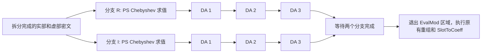

# EvalMod 完整并行策略

日期：2026-09-07；实现更新：2026-09-08。状态：A/B 试验已实现并验证，见
[实现与结果](cpu_evalmod_parallel_results.md)。B 的 EvalMod 中位数约下降 51%，
完整 BTS 约下降 17.5%，但 CPU 时间增加，默认仍为 Legacy。

首版实际调整：逐元素算术采用 Hw 调用内部的 coefficient 分块，避免直接
并行现有 SPOLY 循环时共享单 limb scratch；尚未实现跨 Hw 调用的输出-limb
融合。下文保留原设计目标，其余主要 runtime 路径已按分析的同步边界接入。
范围仅为共轭拆分后的两个 EvalMod 分支，到重组前为止。CoeffToSlot、拆分、
重组和 SlotToCoeff 的算法及调度保持原状。

本设计接续 [第一轮实验结论](cpu_rns_parallel_scheduling_step3.md)。第一轮只
覆盖 DecompModUp 内的 NTT，却关闭了整个双分支并行，最终没有端到端净收益。
这里将优化单位改为完整 EvalMod 的执行链，明确每段应如何分工及何时同步。

## 1. 覆盖对象：不再只改一个 NTT 入口

以下来自同一份已验证的 degree=44、K=28 生成程序及先前 16 线程 perf 中
第一个正式 EvalMod 区间。CPU 样本按调用栈互斥归类，runtime 类别包含其子调用。

| 工作类别 | 静态调用位置 | EvalMod 用户态 CPU 样本 | 当前缺口 |
| --- | ---: | ---: | --- |
| DecompModUp 全部工作 | 32 | 29.56% | 现实验仅并行其中 NTT，未覆盖换基计算 |
| ModDown 全部工作 | 64 | 23.91% | P 部分 INTT、换基、Q 部分 NTT 和修正仍串行 |
| Rescale 全部工作 | 92 | 16.23% | 共享 last-input scratch，按目标 limb 串行推进 |
| 生成的逐元素模算术 | MUL 408 / ADD 482 / SUB 24 | 21.14% | 包含密文乘法、key-switch 累加及加权和，RNS 循环串行 |
| 其它 | — | 9.16% | 初始化、编码、清零等；不能按上述比例推断全部可并行 |

四类主要工作合计约 90.84% 的样本。静态位置数不是运行次数，NTT 样本已经
包含在前三类中，不能再把 44.5% 的 NTT 比例加上去。这些比例用于定义覆盖，
不代表可消除的墙钟时间。

生成代码还含有 106 个 `Encode_double_mask`、256 个 `Init_poly_by_size` 和
1276 个 `Free_poly_data` 位置。它们的准备和生命周期也必须纳入策略，而不是
把全部循环直接放进任务中。

## 2. 整体依赖图与不变项



两个分支独立，但分支内部不是任意操作都可同时执行。第一版保持现有 PS
求值顺序、weighted-sum 顺序和三个 DA 的先后顺序，不另做 PS 子树调度。
每个乘法/平方依赖的 relinearize、rescale、level 对齐仍按原程序推进。

不改变系数、PS 参数、Q/P、scale/level 安排、double-angle 次数；不同时做
平方专门 lowering、额外 Q limb 消除或 allocator 替换。完整策略改变工作分工，
不借数学电路变化获得优势。

## 3. 每一类工作的并行单元与同步点

### 3.1 密文乘法、明文乘法、加减及加权和

- 以输出 limb 为基本工作单元，任务使用对应 modulus、输入切片和输出切片。
- 一个密文乘法任务可完成该 limb 的 c0/c1/c2 运算，保留当前乘法公式。
  不在本轮顺便消除平方中的重复交叉项。
- 加权和按输出 limb 分工，在任务内部按原顺序遍历非零项。保留原有 lazy
  rescale 与最后一次 rescale，避免多个任务并发累加同一输出。
- 大 limb 可以作为一个任务；相邻小工作可分块合并。禁止为单个 coefficient
  创建任务。第一版仅有少量确定的分块参数，不建设自动搜索器。
- 输出分配、必要的零初始化和 scalar plaintext 准备先完成；任务完成后才能
  rescale、修改整体 metadata 或释放输入。初始化如果仍串行，必须在覆盖统计中
  单独可见，不能宣称全部工作已并行。

### 3.2 Relinearize / key-switch

```text
初始化 swk_c0、swk_c1 和 scratch
对每个 decomposition partition，保持顺序：
    DecompModUp(part) 完成
    按 Q/P 输出 limb 并行：更新 swk_c0[q] 和 swk_c1[q]
    等待本 partition 更新完成，再复用 scratch / 进入下一 partition
ModDown(c0)、ModDown(c1) 完成
按输出 limb 执行最终加减，发布结果
```

不能直接并行 partition 循环：当前 `_pgen_ext` 被复用，`swk_c0/c1` 是共享
累加器。并行维度选在输出 limb；同一输出内的 partition 累加顺序保持不变。
第一版也不提前物化所有 partitions，以免扩大工作集。

key 数据只读；`Set_pk0/Set_pk1` 复制的是局部 view metadata。每个分支的 view、
modulus cursor 和 scratch 都必须独立，不能因为复用既有 Get_var 缓存而串台。

### 3.3 DecompModUp

```text
准备输入切片和输出/scratch
    → 按 part2 limb：复制所需数据并执行 INTT
    → 等待：换基需要读取所有 part2 limbs
    → 按 coefficient 块：计算补集模数输出
    → 等待：每个目标 limb 的 NTT 需要其完整 coefficient 向量
    → 按 part1/part3 limb：执行 NTT
    → 等待并发布 metadata，进入 key-switch 累加
```

换基的 `sum[num_compl]` 变为每个 coefficient 块任务私有，保留每个输出
coefficient 内对输入 primes 的累加顺序。不能共用当前循环外的 sum 数组。
继续支持零长度 part1、最后一个不完整 partition、显式 prime 子列表及借用 view。

### 3.4 ModDown：按输出 limb 合并连续工作

```text
复制 P 部分并执行各 P limb 的 INTT
    → 等待
计算 P 输入的 inv_mod_self 预处理
    → 等待所有预处理输入就绪
按输出 Q limb 分工，一个任务内完成：
    固定顺序的 P→Q 求和
    → 该 Q limb 的 NTT
    → (old_q - converted_q) * P_inverse
    → 写回该输出 limb
等待全部输出完成，更新 metadata，释放 P scratch
```

重点是把同一个输出 limb 的换基、NTT、修正连接起来，避免每个小函数各自
启动团队、全局同步、重新读取中间结果。求和仍读取全部 P 输入，不能在其就绪
前开始，也不能修改被其它输出共享读取的 P 数据。

### 3.5 Rescale：先完成公共输入，再并行完整 limb 工作

```text
复制最后一个输入 limb，执行一次 INTT，形成只读 last_coeffs
    → 等待公共输入准备完成
对剩余 Q limbs 分工，一个任务内完成：
    last_coeffs 转换到本 qi 的私有 scratch
    → scratch 的 NTT
    → 修正并写入 res[q]
等待全部 limb 完成 → 更新 level/NTT metadata，释放 scratch
```

当前 `last_input` 不能共享，它会被各 qi 的计算覆盖。每个分块任务需要自己的
N 元素 scratch，任务内复用它顺序处理所负责的 limbs。N=65536 时每份约
512 KiB；分块数受预算限制，避免按每次小操作无限创建缓冲区。
原地 rescale 必须先保存最后一个 limb，且不同输出任务只能写各自的 limb。

## 4. 两个完整候选，共用同一组内核

保留 Legacy 为基线，新增候选使用相同数学 IR、相同分块内核、相同线程上限，
覆盖上面全部主要工作。仅改变分支执行组织。

| 候选 | 分支执行 | 算子内部工作 | 团队 |
| --- | --- | --- | --- |
| Legacy | 两分支并行 | 现有串行内核 | 既有实现 |
| A: OperatorParallel | R 完成后执行 I | 分块任务并行 | 一个 EvalMod 团队 |
| B: BranchAndOperator | R/I 同时推进 | 分块任务并行 | 两分支共享同一 EvalMod 团队 |

采用一个小型 `Run_chunks` 执行入口（设计名），负责把已证明独立的工作块交给
现有 OpenMP 团队。A 的控制流依次调用两个分支；B 分派两个粗粒度 branch task。
两个候选均在内核级等待必要的 taskgroup，避免把团队机制差异混入分支策略比较。

- `task/taskloop` 是可选的具体发射机制，绑定现有团队，不再建立嵌套团队。
- 任务数限制不等于独占线程数；OpenMP 负责在整个团队内分配就绪任务，实际
  活动线程总数不超过 P，不给每个分支各建 P 个线程。
- 分块使用有界数量的粗任务，单 limb NTT 不再拆 butterfly 级任务。
- 保留默认 tied task，不产生逃逸任务；每个内核返回前等待其工作，两个分支
  都完成后才离开 EvalMod 区域。暂不加入通用 DAG 调度、work stealing 自实现
  或多维成本模型。
- 小批次、P=1、未知别名或不支持的上下文走明确的串行路径。外部已有不属于
  本区域的团队时先回退，不借用未知调用者的资源预算。

开发时先保留 B 的双分支能力逐类接入；只有主要内核覆盖完成后，才将 A 当作
“完整算子内并行”候选测量，避免重演关闭整个分支却只覆盖 18% 工作的实验。

## 5. 严格限制在 EvalMod 内

仅凭 opcode 或全局 runtime 开关不够：当前生成程序共有 94 个 ModDown 位置，
其中 64 个在 EvalMod；104 个 Rescale 位置中只有 92 个在 EvalMod。

因此先在编译器内部为两个 EvalMod 分支建立一个有界执行区域：

- 区域入口为共轭拆分完成后的密文，出口为两份完成 DA 的结果；不包括重组。
- 利用结构化块/必要属性表达区域及独立分支，允许 lowering 上下文判断归属。
  它描述独立计算区域，不要求立即输出固定的 OpenMP sections。
- lowering 自动插入的 relin、rescale、临时量准备必须继承区域归属；最终
  flatten 和内存释放处理不能丢失它。不能依靠变量名或生成 C 行号定位范围。
- 区域内发射带执行上下文的入口或并行循环；区域外保持原调用。原 runtime
  ABI 保留，不能全局改变 ModDown/Rescale/NTT helper 的默认行为。
- A/B 都保留分支各自的 scratch 身份。现有 `Enter_parallel_section()` 的
  私有化能力要由逻辑分支作用域继承，不能仅在输出 pragma 时才生效。
- 不新增用户可见 DSL 语法。由内部 bootstrap 分解提供范围和独立性信息，
  CPU lowering/runtime 决定执行；GPU 不消费该 CPU 实验配置。

新增完整候选与旧 `decomp_ntt_threads` 实验明确区分，不能把该旧开关非零
解释为完整覆盖；冲突配置应拒绝。Legacy 继续作为默认。

## 6. 共享状态、生命周期和诊断

- key、prime、twiddle、输入密文只读共享；输出分片、局部 view 和 scratch
  明确归属任务/分支。Q/P 使用真实 stride，未知重叠回退串行。
- 分配及 whole-object metadata 更新由内核控制流完成。任务结束前不得
  Free_poly_data，也不能发布尚未完成的密文供后续算子使用。
- 当前 EvalMod 的 scalar mask 编码是 len=1 路径，使用局部输出并读取编码参数。
  保持每个 scalar plaintext 在相关任务前准备、任务后释放；不直接将这个结论
  推广到会更新全局统计/缓存的任意向量编码路径。
- 现有原子统计更新可以保留，但 threadprivate 的 `Rtm_stack` 不等于
  task-local 栈。跨 taskgroup 等待的父级计时应使用函数局部时间戳/任务归属
  的状态，叶子计时不得跨任务调度点；不能照搬线程栈并假定任务切换总是安全。
- 第二步 `ntt_probe.cxx` 的全局 active 标记假设新入口没有并发调用者，不适用
  于 B。后续验证应将 region/branch/operator 标识显式捕获到任务，在验证模式
  统计执行与回退；正式计时关闭该观察器。

## 7. 接入顺序与验收门槛

1. **区域与执行入口**：建立 EvalMod 作用域、逻辑分支私有化和有界 Run_chunks；
   暂时串行执行叶子，验证区域外调用不变及两个分支生命周期正确。
2. **算术与完整 key-switch**：接入逐元素算术、DecompModUp 全流程及 partition
   内的 key 累加，保留 partition 间同步。
3. **ModDown 与 Rescale**：按上述输出 limb 工作单元接入，复用单 limb 内核。
4. **完整覆盖后比较 A/B/Legacy**：不在中途把部分覆盖候选当作最终策略。

这四步是 EvalMod 内的实现顺序，不扩展到 SlotToCoeff，也不另建通用优化框架。
对无法并行的操作记录原因；小批次回退与未覆盖热点分开统计。

正确性与覆盖门槛：

- 对每种内核检查串行/并行全部系数一致；保持每个输出内的求和与 rescale 顺序。
- 覆盖 Q/P 布局、原地/独立输出、最后一个 partition、任务数少于/多于线程数、
  首次与重复调用、A/B 双分支并发及等待后的 metadata/内存释放。
- 通过任务观察确认四类主要工作确实覆盖，不能只数新入口或 pragma。
- 对区域外 IR 做归一化比较，检查操作、常量、level/scale 及原 runtime 调用
  保持一致；运行时验证新执行入口只出现在 EvalMod 区域。
- 验证完整 BTS 全槽位误差、实际输入输出 Q/scale；参数与此前对比一致。

性能门槛：

- 主要指标为从同一耗尽输入准备得到的 **完整双分支 EvalMod** 时间，不把一个
  NTT 内核的速度当作 EvalMod 收益。每次保留相同输入状态，排除准备与解密。
- 同时测完整 BTS 回归，并检查区域外阶段没有被新策略改变；SlotToCoeff 仅作
  不退化检查，不进行调优。
- 同一库、编译器、CPU affinity、allocator，1/16 线程，每组预热一次、至少
  三次正式调用；记录 CPU 时间、scratch/峰值 RSS、回退和同步开销。
- 主测不带采样，必要时做独立诊断。只有 EvalMod 相对重测 Legacy 有可重复
  收益且完整 BTS 无明显退化时，才讨论新默认；否则保留负面结果和旧配置。

## 8. 本次分析证据

覆盖分析基于 `tmp_cpu_ntt_step2/bts0/generator/output/bootstrap_full.c`，
以及先前 `tmp_openfhe_cpu_compare/step1/evalmod-stacks.txt` 的 1627 个样本。
汇总为 `tmp_evalmod_strategy/coverage.json`。它是对已有数据的重新归类，
当时尚未实现 A/B；后续实际执行证据和实现限制见上方结果报告。

关键源码：
[DSL 求值顺序](../ace_edsl/edsl/core/bootstrap_decomposition.py)、
[key-switch lowering](../fhe-cmplr/poly/src/ckks2poly.cxx)、
[DecompModUp/ModDown/Rescale](../fhe-cmplr/rtlib/ant/poly/src/rns_poly.c)、
[NTT 与换基](../fhe-cmplr/rtlib/ant/poly/src/rns_poly_impl.c)、
[分支 scratch 作用域](../fhe-cmplr/include/fhe/poly/ir_gen.h)。
